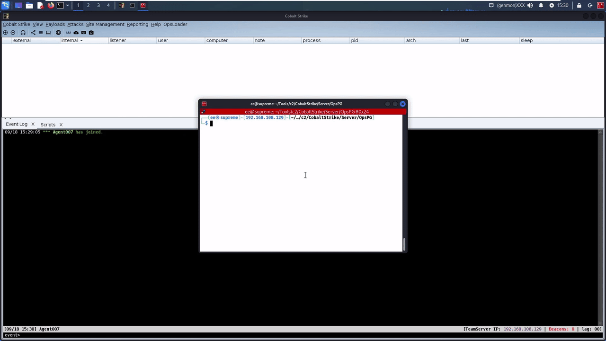

# OpsLoader
A Cobalt Strike payload generator and lateral movement aggressor script which places Beacon shellcode into a custom shellcode loader

## Project Features
* Adds a button to your Cobalt Strike menu bar letting you generate custom payloads by placing RC4 encrypted Beacon shellcode into my custom shellcode loader and compiles it
* Registers a new lateral movement technique 'moveit' to the 'jump' command which will generate Beacon shellcode, RC4 encrypt it, place it into the custom shellcode loader, upload it to the target, then execute the loader with remote-exec psexec.
* Custom shellcode loader that bypasses Microsoft Defender with cloud protection enabled by using RC4 decryption, spawning a new process with PPID/CLI/Directory spoofing, and then performing Early Bird APC Injection for shellcode execution.

## Usage
First place the OpsPG folder where your teamserver binary is. Then import the OpsPG.cna file into Cobalt Strike.

To generate the custom payload, click the 'OpsLoader' button on the menu bar at the top and click 'Generate OpsLoader'. From there, select your desired listener to place into the shellcode loader. The result will be a compiled executable in the OpsPG folder ready to be used.

To perform lateral movement with OpsLoader, run 'jump moveit [target] [listener]'.  This will automatically generate the custom payload stated above, upload it to the target, and execute it with remote-exec psexec.

## Demo

### Payload Generation

### Lateral Movement

## Limitations
* This project only works so far on Linux systems and requires mingw on your box
* So far I only provide a generated payload that performs process injection, nothing local.

## References
* [C# Payload Generator for Windows](https://github.com/Workingdaturah/Payload-Generator)
* [Cobalt Strike Aggressor Functions](https://hstechdocs.helpsystems.com/manuals/cobaltstrike/current/userguide/content/topics_aggressor-scripts/as-resources_functions.htm)
* [Sleep Syntax](http://sleep.dashnine.org/manual/)